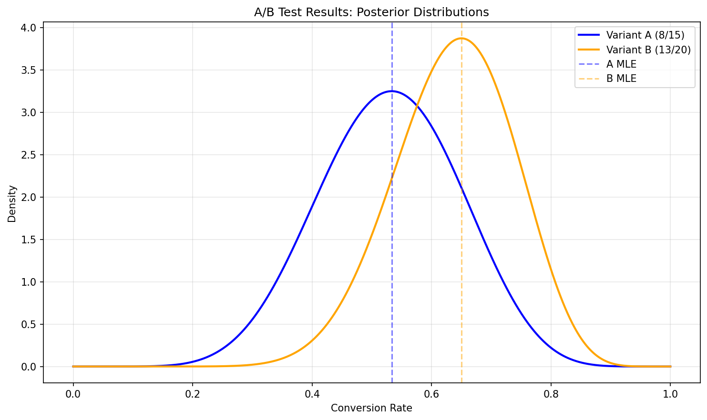
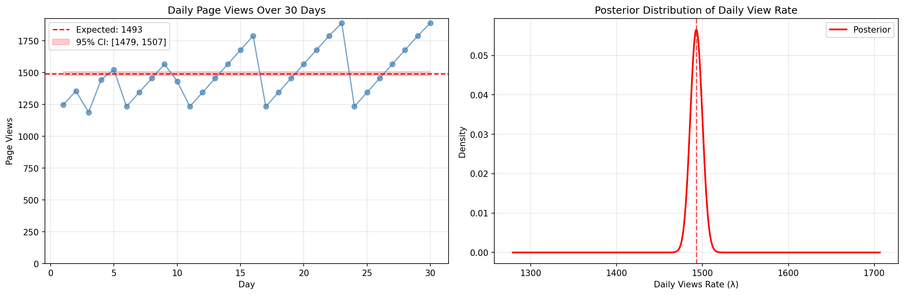
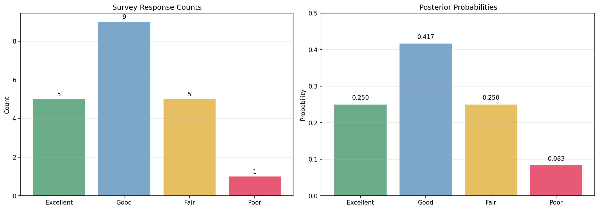
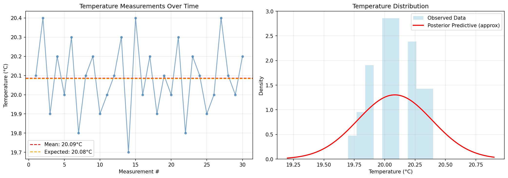
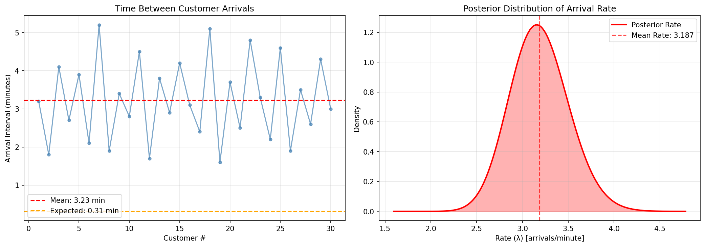

# Raw Data to Posterior: Complete Workflow

This example demonstrates the complete workflow from raw observational data to Bayesian posterior distributions using the helper functions in `conjugate-models`.

## Overview

Instead of manually computing sufficient statistics, you can use helper functions to extract them automatically from raw observational data. This is particularly useful when working with:

- Experimental data from A/B tests
- Time series observations
- Survey responses
- Measurement data from sensors
- Count data from web analytics

## Example 1: A/B Testing with Conversion Rates

Suppose you're running an A/B test on a website and want to analyze conversion rates.

```python
import numpy as np
import matplotlib.pyplot as plt
from conjugate.distributions import Beta
from conjugate.models import binomial_beta
from conjugate.helpers import bernoulli_beta_inputs

# Raw observational data - user conversion outcomes
# 1 = converted, 0 = did not convert
variant_a = [1, 0, 1, 1, 0, 0, 1, 0, 1, 1, 0, 1, 0, 0, 1]  # 8 conversions out of 15 users
variant_b = [1, 1, 0, 1, 1, 0, 1, 0, 0, 1, 1, 1, 0, 1, 0, 1, 1, 0, 1, 1]  # 13 conversions out of 20 users

# Extract sufficient statistics automatically
inputs_a = bernoulli_beta_inputs(variant_a)
inputs_b = bernoulli_beta_inputs(variant_b)

print("Variant A:", inputs_a)  # {'x': 8, 'n': 15}
print("Variant B:", inputs_b)  # {'x': 13, 'n': 20}

# Set up priors (Beta(1,1) = uniform prior)
prior = Beta(1, 1)

# Compute posteriors using extracted statistics
posterior_a = binomial_beta(**inputs_a, prior=prior)
posterior_b = binomial_beta(**inputs_b, prior=prior)

print(f"Variant A: Beta({posterior_a.alpha}, {posterior_a.beta})")
print(f"Variant B: Beta({posterior_b.alpha}, {posterior_b.beta})")

# Plot results
fig, ax = plt.subplots(figsize=(10, 6))
x = np.linspace(0, 1, 1000)

ax.plot(x, posterior_a.dist.pdf(x), label=f'Variant A (8/15)', linewidth=2)
ax.plot(x, posterior_b.dist.pdf(x), label=f'Variant B (13/20)', linewidth=2)
ax.axvline(inputs_a['x'] / inputs_a['n'], color='blue', alpha=0.5, linestyle='--', label='A MLE')
ax.axvline(inputs_b['x'] / inputs_b['n'], color='orange', alpha=0.5, linestyle='--', label='B MLE')

ax.set_xlabel('Conversion Rate')
ax.set_ylabel('Density')
ax.set_title('A/B Test Results: Posterior Distributions')
ax.legend()
ax.grid(alpha=0.3)
plt.show()

# Statistical comparison
prob_b_better = (posterior_b.rvs(10000) > posterior_a.rvs(10000)).mean()
print(f"Probability that B > A: {prob_b_better:.3f}")
```



The visualization shows the posterior distributions for both variants, with Variant B showing a higher conversion rate probability.

## Example 2: Website Analytics - Daily Page Views

Analyzing daily page view counts using Poisson-Gamma conjugacy.

```python
from conjugate.distributions import Gamma
from conjugate.models import poisson_gamma, poisson_gamma_predictive
from conjugate.helpers import poisson_gamma_inputs

# Raw data: daily page views over 30 days
daily_views = [
    1247, 1356, 1189, 1445, 1523, 1234, 1345, 1456, 1567, 1432,
    1234, 1345, 1456, 1567, 1678, 1789, 1234, 1345, 1456, 1567,
    1678, 1789, 1890, 1234, 1345, 1456, 1567, 1678, 1789, 1890
]

# Extract sufficient statistics
inputs = poisson_gamma_inputs(daily_views)
print("Sufficient statistics:", inputs)
# {'x_total': 44691, 'n': 30} - total views across all days

# Prior: weakly informative Gamma(2, 0.001)
# This implies we expect around 2000 views/day initially but with high uncertainty
prior = Gamma(alpha=2, beta=0.001)

# Compute posterior
posterior = poisson_gamma(**inputs, prior=prior)
print(f"Posterior: Gamma({posterior.alpha:.1f}, {posterior.beta:.4f})")

# Expected daily views (posterior mean)
expected_daily_views = posterior.dist.mean()
print(f"Expected daily views: {expected_daily_views:.0f}")

# 95% credible interval
lower, upper = posterior.dist.ppf([0.025, 0.975])
print(f"95% credible interval: [{lower:.0f}, {upper:.0f}]")

# Predictive distribution for tomorrow's views
predictive = poisson_gamma_predictive(distribution=posterior)
pred_mean = predictive.dist.mean()
pred_std = predictive.dist.std()
print(f"Tomorrow's views prediction: {pred_mean:.0f} ± {pred_std:.0f}")
```



The left panel shows daily page views over time, while the right panel displays the posterior distribution of the daily view rate.

## Example 3: Customer Survey Analysis

Analyzing categorical survey responses using Multinomial-Dirichlet conjugacy.

```python
from conjugate.distributions import Dirichlet
from conjugate.models import multinomial_dirichlet
from conjugate.helpers import multinomial_dirichlet_inputs

# Raw survey data: customer satisfaction ratings
responses = ['Excellent', 'Good', 'Fair', 'Good', 'Excellent', 'Fair', 'Good',
             'Excellent', 'Good', 'Good', 'Fair', 'Poor', 'Good', 'Excellent',
             'Fair', 'Good', 'Excellent', 'Good', 'Fair', 'Good']

# Convert to counts automatically
inputs = multinomial_dirichlet_inputs(responses)
print("Response counts:", inputs)

# Count each category
from collections import Counter
counts = Counter(responses)
print("Manual count verification:", dict(counts))

# Set up prior - start with symmetric Dirichlet
categories = ['Excellent', 'Good', 'Fair', 'Poor']
prior_alpha = [1, 1, 1, 1]  # Uniform prior across categories
prior = Dirichlet(prior_alpha)

# For multinomial_dirichlet, we need to convert responses to count array
response_counts = [responses.count(cat) for cat in categories]
posterior = multinomial_dirichlet(x=response_counts, prior=prior)

print(f"Posterior parameters: {posterior.alpha}")

# Posterior probabilities
posterior_probs = posterior.dist.mean()
print("\nPosterior probabilities:")
for cat, prob in zip(categories, posterior_probs):
    print(f"{cat}: {prob:.3f}")

# 95% credible intervals for each category
for i, cat in enumerate(categories):
    lower, upper = posterior.alpha[i] / posterior.alpha.sum(), posterior.alpha[i] / posterior.alpha.sum()
    # More precise credible intervals would require sampling
    print(f"{cat} probability: {posterior_probs[i]:.3f}")
```



The visualization shows the distribution of survey responses and the corresponding posterior probabilities for each satisfaction category.

## Example 4: Sensor Measurements - Temperature Data

Analyzing continuous measurement data with Normal-Inverse-Gamma conjugacy.

```python
from conjugate.distributions import NormalInverseGamma
from conjugate.models import normal
from conjugate.helpers import normal_inputs

# Raw temperature measurements from a sensor (in Celsius)
temperatures = [
    20.1, 20.4, 19.9, 20.2, 20.0, 20.3, 19.8, 20.1, 20.2, 19.9,
    20.0, 20.1, 20.3, 19.7, 20.4, 20.0, 20.2, 19.9, 20.1, 20.0,
    20.3, 19.8, 20.2, 20.1, 19.9, 20.0, 20.4, 20.1, 20.0, 20.2
]

# Extract sufficient statistics
inputs = normal_inputs(temperatures)
print("Sufficient statistics:", inputs)

# Prior: weakly informative Normal-Inverse-Gamma
# mu=20 (expected temperature), nu=1 (low confidence in mu)
# alpha=2, beta=1 (moderate uncertainty about variance)
prior = NormalInverseGamma(mu=20.0, nu=1.0, alpha=2.0, beta=1.0)

# Compute posterior
posterior = normal(**inputs, prior=prior)

print(f"Posterior mean (μ): {posterior.mu:.3f}")
print(f"Posterior precision parameter (ν): {posterior.nu:.1f}")
print(f"Posterior shape (α): {posterior.alpha:.1f}")
print(f"Posterior rate (β): {posterior.beta:.3f}")

# Expected temperature and variance
expected_temp = posterior.mu
expected_variance = posterior.beta / (posterior.alpha - 1) if posterior.alpha > 1 else float('inf')
print(f"Expected temperature: {expected_temp:.3f}°C")
print(f"Expected variance: {expected_variance:.6f}")
```



The left panel shows temperature measurements over time with confidence intervals, while the right panel displays the posterior distribution of the temperature.

## Example 5: Time Between Events - Exponential Model

Analyzing time intervals using Exponential-Gamma conjugacy.

```python
from conjugate.distributions import Gamma
from conjugate.models import exponential_gamma
from conjugate.helpers import exponential_gamma_inputs
import numpy as np

# Raw data: time between customer arrivals (in minutes)
arrival_intervals = [
    3.2, 1.8, 4.1, 2.7, 3.9, 2.1, 5.2, 1.9, 3.4, 2.8,
    4.5, 1.7, 3.8, 2.9, 4.2, 3.1, 2.4, 5.1, 1.6, 3.7,
    2.5, 4.8, 3.3, 2.2, 4.6, 1.9, 3.5, 2.6, 4.3, 3.0
]

# Extract sufficient statistics
inputs = exponential_gamma_inputs(arrival_intervals)
print("Sufficient statistics:", inputs)

# Prior: Gamma(2, 1) - expecting moderate arrival rate
prior = Gamma(alpha=2.0, beta=1.0)

# Compute posterior
posterior = exponential_gamma(**inputs, prior=prior)

# Posterior rate parameter (λ)
rate = posterior.alpha / posterior.beta
expected_interval = 1 / rate

print(f"Posterior rate (λ): {rate:.3f} arrivals/minute")
print(f"Expected interval: {expected_interval:.3f} minutes")

# 95% credible interval for rate
rate_samples = posterior.dist.rvs(10000)
rate_ci = np.percentile(rate_samples, [2.5, 97.5])
interval_ci = 1 / rate_ci[::-1]  # Invert and flip for interval CI

print(f"Rate 95% CI: [{rate_ci[0]:.3f}, {rate_ci[1]:.3f}]")
print(f"Interval 95% CI: [{interval_ci[0]:.3f}, {interval_ci[1]:.3f}] minutes")
```



The left panel shows customer arrival intervals over time, while the right panel displays the posterior distribution of the arrival rate parameter.

## Key Benefits of This Workflow

1. **Automatic Extraction**: No manual computation of sufficient statistics
2. **Type Safety**: Helper functions handle data type conversions
3. **Consistency**: Guaranteed compatibility between helpers and models
4. **Flexibility**: Works with lists, numpy arrays, and other array-like data
5. **Error Reduction**: Eliminates common mistakes in statistic computation

## Best Practices

1. **Always verify your data**: Check the extracted statistics make sense
2. **Choose appropriate priors**: Use domain knowledge to set informative priors
3. **Validate assumptions**: Ensure your data matches the model assumptions
4. **Visualize results**: Plot posteriors and predictive distributions
5. **Test edge cases**: Consider empty data, single observations, etc.

This workflow enables rapid Bayesian analysis of real-world data with minimal boilerplate code!
